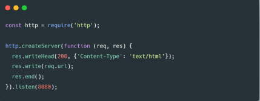

# Writing and Presentation Test Week 6

---

## Day 1 - Web Server & RESTful API

### Web Server

Web Server merupakan sebuah software (perangkat lunak) yang memberikan layanan berupa data. Berfungsi untuk menerima permintaan HTTP atau HTTPS dari klien atau kita kenal dengan web browser (Chrome, Firefox). Selanjutnya ia akan mengirimkan respon atas permintaan tersebut kepada client dalam bentuk halaman web.
Web server terdiri dari 2 komponen penting:
**1. Hardware**
Di sisi perangkat keras, server web adalah komputer yang menyimpan perangkat lunak server web dan file komponen situs web. (misalnya, dokumen HTML, gambar, CSS stylesheet, dan file JavaScript) Server web terhubung ke Internet dan mendukung pertukaran data fisik dengan perangkat lain yang terhubung ke web.
**2. Software**
Di sisi perangkat lunak, server web mencakup beberapa bagian yang mengontrol bagaimana pengguna web mengakses file yang dihosting. Minimal, ini adalah server HTTP. Server HTTP adalah perangkat lunak yang memahami URL (alamat web) dan HTTP (protokol yang digunakan browser Anda untuk melihat halaman web). Server HTTP dapat diakses melalui nama domain situs web yang disimpannya, dan mengirimkan konten situs web yang dihosting ini ke perangkat pengguna akhir.

#### Static Web Server VS Dynamic Web Server

**Static Web Server**
Server web statis, atau tumpukan, terdiri dari komputer (perangkat keras) dengan server HTTP (perangkat lunak). Kami menyebutnya "statis" karena server mengirimkan file yang dihosting apa adanya ke browser kita.

**Dynamic Web Server**
Sebuah server web dinamis terdiri dari server web statis ditambah perangkat lunak tambahan, paling sering server aplikasi dan database. Kami menyebutnya "dinamis" karena server aplikasi memperbarui file yang dihosting sebelum mengirim konten ke browser kita melalui server HTTP.

#### Server side Programming

Server web menunggu pesan permintaan klien, memprosesnya saat tiba, dan membalas browser web dengan pesan respons HTTP. Respons berisi baris status yang menunjukkan apakah permintaan berhasil atau tidak (Contoh. "HTTP/1.1 200 OK" untuk berhasil).

Isi respons yang berhasil atas permintaan akan berisi sumber daya yang diminta (misalnya halaman HTML baru, atau gambar, dll...), yang kemudian dapat ditampilkan oleh browser web.

#### Static Site

Diagram pada slide berikutnya menunjukkan arsitektur server web dasar untuk situs statis (situs statis adalah situs yang mengembalikan konten hard-coded yang sama dari server setiap kali sumber daya tertentu diminta). Saat pengguna ingin menavigasi ke halaman, browser mengirimkan permintaan "GET" HTTP yang menentukan URL-nya.


#### Dynamic Site

Situs web dinamis adalah situs di mana beberapa konten respons dihasilkan secara dinamis, hanya bila diperlukan. Di situs web dinamis, halaman HTML biasanya dibuat dengan memasukkan data dari database ke dalam placeholder di template HTML (ini adalah cara yang jauh lebih efisien untuk menyimpan konten dalam jumlah besar daripada menggunakan situs web statis).

Situs dinamis dapat mengembalikan data yang berbeda untuk URL berdasarkan informasi yang diberikan oleh pengguna atau preferensi yang disimpan dan dapat melakukan operasi lain sebagai bagian dari pengembalian respons (misalnya, mengirim pemberitahuan).

Sebagian besar kode untuk mendukung situs web dinamis harus dijalankan di server. Membuat kode ini dikenal sebagai "pemrograman sisi server" (atau terkadang "skrip back-end").


#### Ilustration Details

1. Permintaan untuk sumber daya statis (Requests for static resources) ditangani dengan cara yang sama seperti untuk situs statis (sumber daya statis adalah file apa pun yang tidak berubah —biasanya: CSS, JavaScript, Gambar, file PDF yang dibuat sebelumnya, dll.).
2. Diagram sederhana dari server web yang menggunakan pemrograman sisi server untuk mendapatkan informasi dari database dan membuat HTML dari template. Ini adalah diagram yang sama seperti pada gambaran umum Client-Server. Permintaan untuk sumber daya dinamis malah diteruskan ke kode sisi server (ditunjukkan dalam diagram sebagai Aplikasi Web).
3. Untuk "permintaan dinamis (dynamic requests)" server menafsirkan permintaan, membaca informasi yang diperlukan dari database.
4. Menggabungkan data yang diambil dengan template HTML
5. dan mengirimkan kembali respons yang berisi HTML yang dihasilkan (5,6)

#### Perbedaan static dan Dynamic Site

- Static dan dynamic site memiliki tujuan dan perhatian yang berbeda.
- Static dan dynamic site umumnya tidak menggunakan bahasa pemrograman yang sama (pengecualiannya adalah JavaScript, yang dapat digunakan di sisi server dan klien).
- Static dan dynamic site berjalan di dalam lingkungan sistem operasi yang berbeda.

#### Apa yang dapat kita lakukan di sisi server?

1. Penyimpanan dan pengiriman informasi yang efisien
2. Pengalaman pengguna yang disesuaikan
3. Akses terkontrol ke konten
4. Simpan informasi sesi/status
5. Pemberitahuan dan komunikasi
6. Data analisis

### REST

REST, atau Representational State Transfer, adalah gaya arsitektur untuk menyediakan standar antara sistem komputer di web, sehingga memudahkan sistem untuk berkomunikasi satu sama lain.

Sistem yang sesuai dengan REST, sering disebut sistem RESTful, dicirikan oleh bagaimana mereka tidak memiliki kewarganegaraan dan memisahkan masalah klien dan server

Dalam gaya arsitektur REST, implementasi klien dan implementasi server dapat dilakukan secara independen tanpa saling mengetahui satu sama lain.

Ini berarti bahwa kode di sisi klien dapat diubah setiap saat tanpa mempengaruhi operasi server, dan kode di sisi server dapat diubah tanpa mempengaruhi operasi klien.

Dengan menggunakan antarmuka REST, klien yang berbeda mencapai titik akhir REST yang sama, melakukan tindakan yang sama, dan menerima respons yang sama.
Klien dapat berupa platform web, platform seluler, atau platform desktop.

#### Komunikasi antara Client dan Server

**Making Requests**
REST mengharuskan klien membuat permintaan ke server untuk mengambil atau mengubah data di server. Permintaan umumnya terdiri dari:

- kata kerja HTTP, yang mendefinisikan jenis operasi apa yang harus dilakukan
- header, yang memungkinkan klien untuk menyampaikan informasi tentang permintaan (request)
- jalan menuju sumber daya (resource)
- badan pesan opsional yang berisi data

**HTTP VERBS**
Ada 4 kata kerja HTTP dasar yang kami gunakan dalam permintaan untuk berinteraksi dengan resources dalam sistem REST:

1. GET — mengambil resource tertentu (berdasarkan id) atau kumpulan sumber daya
2. POST — buat resource baru
3. PUT — perbarui resource tertentu (berdasarkan id)
4. DELETE — menghapus resource tertentu dengan id

#### Headers and Accept Parameters

Di header permintaan, klien mengirimkan jenis konten yang dapat diterimanya dari server.

Ini disebut bidang Terima, dan ini memastikan bahwa server tidak mengirim data yang tidak dapat dipahami atau diproses oleh klien. Opsi untuk tipe konten adalah Tipe MIME (atau Ekstensi Surat Internet Serbaguna).
Tipe lain dan subtipe yang umum digunakan:

- image - image/png, image/jpeg, image/gif
- audio - audio/wav, audio/mpeg
- video - video/mp4, video/ogg
- application - application/json, application/pdf, application/xml, application/octet-stream

**Contoh:**
Misalnya, klien yang mengakses sumber daya dengan id 23 di sumber artikel di server mungkin mengirim permintaan GET seperti ini:

GET/artikel/23
Accept: teks/html, aplikasi/xhtml

Bidang header Terima dalam hal ini mengatakan bahwa klien akan menerima konten dalam teks/html atau aplikasi/xhtml.

#### Paths

Permintaan harus berisi jalur ke sumber daya tempat operasi harus dilakukan. Dalam RESTful API, jalur harus dirancang untuk membantu klien mengetahui apa yang sedang terjadi.

A Path seperti :
skilvulstore.com/customers/223/orders/12
jelas dalam apa yang ditunjuknya, bahkan jika Anda belum pernah melihat jalur khusus ini sebelumnya, karena jalur ini bersifat hierarkis dan deskriptif.

Kita dapat melihat bahwa kita mengakses pesanan dengan id 12 untuk pelanggan dengan id 223.

#### Sending Responses

Misalnya, ketika klien mengakses sumber daya dengan id 23 di sumber artikel dengan Permintaan GET ini:

GET/artikel/23 HTTP/1.1
Accept: teks/html, aplikasi/xhtml

Server mungkin mengirim kembali konten dengan header respons:
HTTP/1.1 200 (Oke)
Tipe-Konten: teks/html

#### Response Codes

Tanggapan dari server berisi kode status untuk memperingatkan klien tentang informasi tentang keberhasilan operasi. Sebagai pengembang, Anda tidak perlu mengetahui setiap kode status (ada banyak kode status), tetapi Anda harus mengetahui kode yang paling umum dan cara penggunaannya.


Untuk setiap kata kerja HTTP, ada kode status yang diharapkan yang harus dikembalikan server setelah berhasil:

- GET — return 200 (OK)
- POST — return 201 (CREATED)
- PUT — return 200 (OK)
- DELETE — return 204 (NO CONTENT) Jika operasi gagal, kembalikan kode status paling spesifik yang mungkin terkait dengan masalah yang ditemui.

#### Contoh requests dan Responses

Katakanlah kami memiliki aplikasi yang memungkinkan Anda untuk melihat, membuat, mengedit, dan menghapus pelanggan dan pesanan untuk toko pakaian kecil yang dihosting di skilvul-store.com.

- Jika kami ingin melihat semua pelanggan, permintaannya akan terlihat seperti ini:
  

- Header respons yang mungkin akan terlihat seperti dan diikuti oleh data pelanggan yang diminta dalam format application/json.
  

- Membuat customer baru berdasarkan posting data:
  

- Server kemudian menghasilkan id untuk objek itu dan mengembalikannya kembali ke klien, dengan header seperti:
  

- Kami dapat memperbarui pelanggan itu dengan PUT data baru dan Header respons yang mungkin akan memiliki Kode Status: 200 (OK), untuk memberi tahu klien bahwa item dengan id 123 telah dimodifikasi.
  

---

## Day 2 - Intro & Essential Node.js

### Node Js

Node.js merupakan lingkungan runtime JavaScript open-source, lintas platform, back-end yang berjalan pada mesin V8 dan mengeksekusi kode JavaScript di luar browser web. Node.js memungkinkan pengembang menggunakan JavaScript untuk menulis alat baris perintah dan untuk skrip sisi server—menjalankan skrip sisi server untuk menghasilkan konten halaman web dinamis sebelum halaman dikirim ke browser web pengguna.

Node.js itu secara sederhananya, merupakan platform JavaScript yang dapat berjalan di backend atau server-side, di komputer kita secara langsung.

### Node REPL

Node REPL membuat kita bisa langsung menggunakan dan mengeksekusi kode Javascript dengan menjalankan node di terminal.

### Global Namespace

Secara default, Node memiliki beberapa variabel global yang dapat diakses dan dimodifikasi, seperti global, process, dll

Biasanya variabel process.env sering digunakan untuk menyimpan configuration ataupun credentials yang sifatnya rahasia, yang bisa digunakan di dalam aplikasi.

### NPM

NPM atau (Node Package Manager) adalah package dan dependency manager utama pada NodeJS. NPM sendiri merangkap sebagai website, registry, platform dan ekosistem Node.

Dependency adalah suatu unsur metode untuk memisahkan dan mengintegrasikan berbagai program berbeda menjadi program yang utuh.

NPM sudah otomatis terinstal ke komputer kita setelah kita menginstall Node JS.

Untuk menjadikan projek Node kita bisa mengakses berbagai module yang ada di NPM, kita perlu menginisialisasi file package.json, sebuah file config yang akan menyimpan metadata project kita.
[Metadata](https://docs.npmjs.com/files/package.json)

### Node JS Architecture

**Single Thread**
Thread dalam ilmu komputer adalah eksekusi menjalankan beberapa tugas atau program secara bersamaan. Setiap unit yang mampu mengeksekusi kode disebut thread.

Javascript menggunakan konsep single thread, yang berarti hanya memiliki satu tumpukan panggilan yang digunakan untuk menjalankan program.

Javascript menggunakan call stack untuk melakukan manajemen single thread. Ketika terdapat perintah baru maka akan ditambahkan (push) dan akan di keluarkan ketika perintahnya sudah selasai (pop)

**Even Loop**
Dengan menggunakan konsep arsitektur javascript, walaupun menggunakan single thread tetapi kita dapat melihat javascript seperti menggunakan multi thread

Terdapat event queue yang berguna sebagai penampung ketika terdapat perintah baru yang akan dieksekusi.

Event loop akan memfasilitasi kondisi ini, event loop akan memeriksa terus menerus, ketika antrian kosong di call stack maka akan menambah antrian baru dari event queue sampai semua perintah selesai di eksekusi.

**Server Side Scripting**
Sejatinya javascript merupakan bahasa pemrograman yang digunakan di front end side. Sehingga kita hanya bisa mengerjakan javascript dengan menggunakan browser untuk menampilkan hasil eksekusinya.
Tetapi dengan menggunakan NodeJS kita dapat menjalankan javascript di server side menggunakan terminal command line menggunakan perintah “node”.

### Javascript For Node JS

Sebelum masuk lebih dalam ke Node JS, terdapat beberapa materi yang perlu direview dan di pahami lagi dari bahasa pemorgraman javascript agar mempermudah memahami Node JS yaitu :
**- Arrow function expression**
Arrow expression merupakan fitur terbaru dari javascript, yaitu mempermudah membuat sintaks function menggunakan “=>”

**- Asynchronous**
Asynchronous merupakan konsep yang paling penting dari javascript. Pada dasarnya, javascript mengeksekusi code secara single thread dan berurutan baris per baris yang disebut dengan synchronous. Sedangkan asynchronous memungkinkan mengeksekusi code tanpa berurutan dengan cara “skip” code dan melanjutkan eksekusi code selanjutnya. Konsep ini menungkinkan code kita tidak terjadi blocking dan lebih efisien.

**- JSON**
JSON atau Javascript Object Notation merupakan format yang digunakan untuk menyimpan dan mengirim data menggunakan konsep object di javascript. JSON dapat digunakan di hampir semua bahasa pemrograman sehingga sangat cocok untuk dipelajari

### Node JS for Backend Development

#### Build In Module Node JS

NodeJS punya beberapa Module Built-in yang bisa langsung kita pakai sesuai kebutuhan aplikasi NodeJS kita.
[Module](https://nodejs.org/api/modules.html)

Kita juga bisa mengimport module built-in tersebut, ataupun Package module yang yang kita buat sendiri nantinya.
**Console**
Console merupakan module bawaan dari javascript yang ada di node JS untuk digunakan sebagai debug atau menampilkan code secara interface
[Console](https://developer.mozilla.org/en-US/docs/Web/API/console)

**Process**
Process adalah modules yang digunakan untuk menampilkan dan mengontrol prosess Node JS yang sedang dijalankan.
[Process](https://nodejs.org/api/process.html)

**OS**
OS module merupakan module yang digunakan untuk menyediakan informasi terkait sistem operasi komputer yang digunakan user.
[OS](https://www.w3schools.com/nodejs/ref_os.asp)

**Util**
Module Util merupakan alat bantu / utilities untuk mendukung kebutuhan internal API di Node JS
[Util](https://nodejs.org/api/util.html)

**Events**
Contoh berikut menunjukkan instance EventEmitter sederhana dengan satu listener. Metode eventEmitter.on() digunakan untuk mendaftarkan pendengar, sedangkan metode eventEmitter.emit() digunakan untuk memicu peristiwa.

```java
import { EventEmitter } from 'node:events';

class MyEmitter extends EventEmitter {}

const myEmitter = new MyEmitter();
myEmitter.on('event', () => {
  console.log('an event occurred!');
});
myEmitter.emit('event');
```

[Events](https://nodejs.org/api/events.html)

**Errors**
Errors merupakan modules yang dapat digunakan untuk mendefinisikan error di Node JS sehingga lebih informatif. Kita juga dapat menghandle error menggunakan try catch
[Errors](https://nodejs.org/api/errors.html)

**Buffer**
Buffer merupakan modules yang digunakan untuk mengakses, mengelola dan mengubah tipe data raw atau tipe data bytes
[Buffer](https://nodejs.org/api/buffer.html)

**FS**
Fs atau “file system” merupakan module yang dapat membantu berinteraksi dengan file yang ada diluar code. FS paling sering digunakan untuk membaca file dengan ekstensi .txt, .csv, dan .json
[FS](https://nodejs.org/api/fs.html)

**Timers**
Timers merupakan modules yang digunakan untuk melakukan scheduling atau mengatur waktu pemanggilan fungsi yang dapat diatur di waktu tertentu
[Timers](https://nodejs.org/api/timers.html)

### Membuat Web Server dengan Node JS

**Node Js Web Server**
Node.js memiliki built-in modul yang disebut HTTP, built-in modul ini memungkinkan Node JS mentransfer data melalui Hyper Text Transfer Protocol (HTTP).

Modul HTTP dapat membuat server HTTP yang mendengarkan port server dan memberikan respons kembali ke klien.

- Untuk menggunakan modul HTTP, gunakan require()
- Gunakan method createServer() untuk membuat server HTTP
- Callback function yang digunakan pada method http.createServer(), akan dijalankan ketika seseorang mencoba mengakses komputer pada port 8080.
  

**Menambahkan HTTP Header**
Kita bisa menggunakan method res.writeHead() untuk menambahkan header HTTP.
Argumen pertama dari method res.writeHead() adalah status code, 200 berarti semuanya OK
Argumen kedua adalah objek yang berisi header respons.

Contoh :
Jika respons dari server HTTP seharusnya ditampilkan sebagai HTML, maka kita harus menambahkan header HTTP dengan tipe konten yang benar


Respons yang dikembalikan dari HTTP web server bisa dalam berbagai format.
Contohnya, Kita bisa mengembalikan response dalam format JSON dan HTML, namun kita juga dapat mengembalikan format teks lain seperti XML dan CSV.
Selain itu web server dapat mengembalikan data non-teks seperti PDF, file zip, audio, dan video.
Format ini harus ditambahkan kedalam HTTP Header.
[Menambahkan HTTP Header](https://www.geeksforgeeks.org/http-headers-content-type/)

**Membaca Query String**
Callback function pada method http.createServer() memiliki argumen req yang mewakili request dari klien, sebagai objek (objek http.IncomingMessage).

Objek ini memiliki sebuah properti yang disebut "url" yang menyimpan informasi url yang sedang mengakses.


Ketika server di jalankan, kemudian kita akses dari browser ke url : http://localhost:8080/skilvul
maka akan tampil tulisan skilvul.

Ketika server di jalankan, kemudian kita akses dari browser ke url : http://localhost:8080/javascript
maka akan tampil tulisan javascript.

---

## Day 3 - Express.js

### Express Js

Express.js, atau hanya Express, adalah kerangka aplikasi web back end untuk Node.js, dirilis sebagai perangkat lunak sumber terbuka dan gratis di bawah Lisensi MIT. Ini dirancang untuk membangun aplikasi web dan API. Ini telah disebut sebagai kerangka kerja server standar de facto untuk Node.js.

### Backend Web Application

Back end app adalah aplikasi yang berjalan di server-side yang bekerja untuk memberikan informasi berupa data sesuai request dari client / browser / front end app. Umumnya server-side app membuat REST API
Kelebihan dari framework ini terletak pada fitur caching, support dengan Google V8 Engine, JavaScript, serta didukung oleh komunitas dan skalabilitas aplikasi yang baik.

### REST API

RESTful API / REST API merupakan penerapan dari API (Application Programming Interface).

Sedangkan REST (Representional State Transfer) adalah sebuah arsitektur metode komunikasi yang menggunakan protokol HTTP untuk pertukaran data dimana metode ini sering diterapkan dalam pengembangan aplikasi. Dengan tujuannya untuk menjadikan sistem memiliki performa yang baik, cepat dan mudah untuk di kembangkan (scale) terutama dalam pertukaran dan komunikasi data.
RESTFUL API memiliki 4 komponen penting, yaitu:

1. URL Design
2. HTTP Verbs
3. HTTP Response Code
4. Format Response

### Install Express JS

Karena express JS merupakan sebuat modules atau package yang dikembangkan menggunakan bahasa javascript, maka kita bisa menggunakan NPM untuk menginstall express JS.

```java
npm install express --save
```

**Preparation**
Terdapat beberapa module yang perlu diinstal untuk mempermudah develop server side application, seperti nodemon (agar dapat restart application otomatis selama proses development).

```java
npm install --save-dev nodemon
```

### Basic Syntax Express JS


Contoh diatas adalah basic syntax dari express JS. Kita akan menggunakan module express kemudian yang berisi routing dan listen.

### Basic Routes

#### Routes

Routes merupakan sebuah end point yang dapat kita akses menggunakan URL di website. Didalam routes kita perlu menentukan method API, alamat dan response apa saja yang akan dikeluarkan.


Kita bisa menjalankan aplikasi sederhana kita dengan cara menggunakan “node”. Dan aplikasi kita akan berjalan di alamat ‘http://localhost:3000’

Kemudian kita dapat mengaksesnya di website dan menambah route yang akan kita akses yaitu “/”

```java
node app.js
```

#### Method

Kita dapat menggunakan method yang dalam REST API seperti POST, PUT, PATCH dan DELETE

```java
app.Post('/posting', (req, res) => {
  res.send("posting sukses!!")
})

app.Delete('/deleteing', (req, res) => {
  res.send("deleting sukses!!")
})
```

#### Response

Di dalam route kita dapat mengirim response menggunakan parameter dari route express.js yaitu “res.Send()” untuk mengirim plain text ketika kita mengakses route tersebut. Terdapat banyak response yang bisa kita buat selain yang dicontohkan.
[Response](http://expressjs.com/en/api.html#res)

Kita dapat mengirim response berupa output json yang biasa dipakai untuk back end application. Dengan menggunakan output json maka kita dapat mengirim data yang mudah diakses


#### Status Code

Dalam pengaplikasian back end application, kita sangat perlu memberikan status code sebagai informasi apakah route yang kita akses berjalan sebagaimana mestinya dan tidak terjadi error.

[Status Code](https://developer.mozilla.org/en-US/docs/Web/HTTP/Status)

#### Query

Query merupakan parameter yang digunakan untuk membantu menentukan tindakan yang lebih spesifik daripada hanya sekedar router biasa. Biasanya query ditaruh di akhir route dengan memberikan informasi diawali dengan “?” kemudian tedapat key dan data yang dapat ditindak lanjuti. **Ex : “?q=hello&age=23”**

Bagi yang sadar, ketika kita search di google maka terdapat query di route yang kita akses

Di ExpressJS kita juga dapat membaca query menggunakan req.query, kemudian informasi tersebut dapat kita olah atau kita kembaliakan lagi seperti contoh


#### Nested Route

Nested route digunakan ketika terdapat banyak route yang memiliki nama yang sama atau ingin membuat route yang lebih mendalam


### Middleware

Middleware function adalah sebuah fungsi yang memiliki akses ke object request (req), object response (res), dan sebuah fungsi next didalam request-response cycle.
Fungsi next biasanya di berikan nama variable next.

**Bagaimana Cara Middleware Bekerja?**
Untuk memahami cara kerja middleware, bayangkan Anda memiliki stan minuman lemon di mana pelanggan membawa lemon mereka sendiri dan Anda membuat minuman lemon dari buah yang di bawa langsung oleh pelanggan.

Anda bertanggung jawab untuk mengevaluasi asal dan kesegaran buah lemon, membuang lemon di bawah standar, dan, akhirnya, membuat minuman lemonnya.

Untuk mengurangi beban kerja Anda, Anda mempekerjakan seorang pekerja — kita akan memanggilnya Larry — yang bertugas untuk memastikan lemon ditanam secara organik dan tanpa bahan kimia berbahaya.

Dalam analogi ini, Larry adalah middleware yang berfungsi antara Anda dan pelanggan Anda.

Sekarang Anda mendapat untung, jadi Anda mempekerjakan dua karyawan lain, Curly dan Moe.

Larry akan memeriksa asal buah lemon dan memberikan buah lemon yang ditanam secara organik kepada Curly.

Kemudian, Curly yang membuang lemon busuk dan menyerahkan lemon yang bagus kepada Moe.

Selanjutnya, Moe akan memverifikasi kesegaran buah lemon dan memberikan buah lemon segar kepada Anda.

Sekarang Anda dapat fokus untuk membuat minuman lemon dan meningkatkan keuntungan Anda, tanpa perlu memikirkan pekerjaan filtering buah lemon.

Dari ilustrasi diatas, kita bisa menganalogikan bahwa buah lemon yang di bawa sendiri oleh pelanggan adalah sebuah HTTP request, dan stan minuman lemon adalah sebuah server.

Anda akan memeriksa asal buah lemon yang di bawa langsung oleh pelanggan, sama seperti yang Anda lakukan dengan sebuah HTTP request, sebelum menerima atau menolak sebuah HTTP request.

Tidak semua HTTP Request itu bagus dan benar, jadi server masih perlu melakukan filtering request.

Karyawan Anda - Larry, Curly, dan Moe – bisa di ibaratkan seperti middleware function untuk stan minuman lemon Anda.

Jika pada tahap mana pun middleware function menentukan bahwa suatu HTTP Request adalah request yang buruk dan salah, maka middleware function memiliki kemampuan untuk menghentikan request-response cycle.

Berlaku juga sebaliknya, jika middleware function menentukan suatu HTTP Request baik dan benar, maka middleware function memiliki kemampuan untuk melanjutkan request-response cycle ke proses selanjutnya.

Setelah sebuah HTTP Request melewati semua middleware yang ada di aplikasi, HTTP Request tersebut akan mencapai handler function — yang, dalam kasus contoh ilustrasi ini, adalah Anda yang menjual minuman lemon (atau, lebih khusus lagi, proses membuat minuman lemon).

Setelah sebuah HTTP Request melewati semua middleware yang ada di aplikasi Anda, HTTP Request tersebut akan mencapai handler function — yang, dalam kasus contoh ilustrasi ini, adalah Anda yang menjual minuman lemon (atau, lebih khusus lagi, proses membuat minuman lemon).

Ini hanya contoh sederhana. Dalam skenario nyata, Kita mungkin perlu menggunakan beberapa middlewares untuk melakukan satu tugas, seperti melakukan pencatatan setiap HTTP Request ataupun melakukan validasi inputan user.

#### Yang bisa dilakukan oleh Function Middleware\*\*

Pada Dasarnya, sebuah middleware function dapat melakukan tugas-tugas berikut :
**- Menjalankan kode apapun.**
Sebuah function middleware bisa digunakan untuk mengeksekusi kode apapun untuk suatu tujuan tertentu.
Sebagai contoh, kita akan membuat sebuah middleware function yang akan mencetak tulisan “Halo Skilvul, request diterima!” Ketika sebuah HTTP Request masuk kedalam middleware function ini.
Middleware Function ini akan diberi nama dengan skilvulLogger.


**- Memodifikasi Object Request dan Object Response.**
Sebuah function middleware bisa digunakan untuk memodifikasi Object Request dan Object Response.
Sebagai contoh, kita akan membuat sebuah middleware function yang akan menambahkan informasi request time pada object request.
Middleware Function ini akan diberi nama dengan addRequestTime.


**\* Menghentikan request-response cycle.**
Sebuah function middleware bisa digunakan untuk menghentikan request-response cycle.
Sebagai contoh, kita akan membuat sebuah middleware function yang akan menghentikan request-response cycle.
Middleware Function ini akan diberi nama dengan stopHere.
Request tidak akan pernah sampai ke handler function, karena middleware telah menghentikan request-response cycle dengan res.send() dan tidak memanggil next()


**- Melanjutkan ke middleware function selanjutnya atau ke handler function dalam suatu request response cycle.**
Sebuah function middleware bisa digunakan untuk melanjutkan ke middleware function selanjutnya / ke handler function.

Sebenarnya kita sudah melakukannya pada contoh-contoh sebelumnya, yaitu dengan cara memanggil function next() pada sebuah middleware function.

Jika sebuah middleware function tidak mengakhiri request-response cycle, maka middleware tersebut harus memanggil function next() untuk melanjutkan request ke middleware function selanjutnya / ke handler function.

Apabila hal tersebut tidak dilakukan (memanggil function next()), maka request akan tetap dalam kondisi menggantung (tidak mengembalikan response) sampai terjadinya error timeout.

#### Jenis Express Middleware Berdasarkan Cara Penggunaan

Express Middleware dapat dikelompokkan berdasarkan dari dimana middleware function itu digunakan :
**- Application Level Middleware**
Application Level Middleware adalah sebuh function middleware yang melekat ke instance object Application Express.
Penggunaannya dengan cara memanggil method app.use().
Application Level Middleware akan di jalankan setiap kali Express Application menerima sebuah HTTP Request.


**- Router Level Middleware**
Router Level Middleware adalah sebuh function middleware yang cara kerjanya sama persis dengan application level middleware, yang menjadikan perbedaan adalah middleware function ini melekat ke instance object Router Express.

Penggunaannya dengan cara memanggil method express.Router().

Router Level Middleware hanya akan di jalankan setiap kali sebuah Express Router yang menggunakan middleware ini menerima sebuah HTTP Request, sedangan pada Router yang lain tidak akan dijalankan.


**- Error Handling Middleware**
Error Handling mengacu kepada bagaimana cara sebuah Express Application menangkap dan memproses error yang terjadi, baik itu berupa kesalahan yang synchronous maupun asynchronous.

Express Application sudah menyediakan error handle function default, sehingga kita tidak perlu lagi membuat sendiri functionnya.

Error handle function default milik Express Application hanyalah kerangka functionnya saja, kita tetap harus menuliskan di dalam function ini bagaimana sebuah error akan di handle.

Error Handling Middleware digunakan pada Application Level Middleware


Sebuah error handling middleware function harus memberikan 4 (empat) buah argument (err, req, res, next) agar bisa di deteksi oleh Express Application sebagai error handling middleware, sekalipun kita tidak akan pernah menggunakan function next dalam error handling middleware ini.

Jika hal ini tidak dilakukan, maka Express Application tidak akan mengenali middleware function ini sebagai error handling middleware, dan akan memperlakukan middleware ini sebagai Application Level Middleware seperti biasa.

#### Jenis Express Middleware Berdasarkan Source Middleware Function

Express Middleware dapat juga dikelompokkan berdasarkan dari dimana middleware function itu didapatkan :

##### Express Build-in Middleware

Express JS sudah menyediakan 3 buah build-in middleware function yang bisa digunakan :
**- express.static()**
express.static() merupakan salah satu build-in middleware function yang disediakan oleh Express JS.
Middleware function ini memungkinkan sebuah express application melayani asset statis berupa file, seperti file HTML, gambar, video, dokumen, dan sebagainya.
[Dokumentasi lengkap](https://expressjs.com/en/4x/api.html#express.static)

**- express.json()**
express.json() merupakan salah satu build-in middleware function yang disediakan oleh Express JS.
Middleware function ini memungkinkan sebuah express application menerima HTTP Request yang membawa payload (data) dalam format JSON.
Middleware function ini tersedia di Express JS versi 4.16.0+
[Dokumentasi lengkap](https://expressjs.com/en/4x/api.html#express.json)

**- express.urlEncoded()**
express.urlEncoded() merupakan salah satu build-in middleware function yang disediakan oleh Express JS.
Middleware function ini memungkinkan sebuah express application menerima HTTP Request yang membawa payload (data) dalam format urlencoded.

Middleware function ini tersedia di Express JS versi 4.16.0+
[Dokumentasi lengkap](https://expressjs.com/en/4x/api.html#express.urlencoded)

**- Third Party (custom) Middleware**
Membuat custom middleware function atau menggunakan third party middleware function dapat menambahkan fungsionalitas dari sebuah Express Application.

Contoh custom middleware seperti function skilvulLogger yang sudah kita buat sebelumnya.
Selain membuat sendiri middleware function custom, kita bisa juga menggunakan third party middleware (middleware function yang di buat oleh orang lain).

Ada beberapa Third Party middleware yang di Kelola oleh Express JS team, ada juga yang di Kelola secara community.

Berikut adalah contoh third party middleware yang dikelola oleh Express JS Team :

- cors
- body-parser
- errorhandler
- morgan
- Multer

[list lengkap third party middleware](https://expressjs.com/en/resources/middleware.html)

Berikut adalah contoh third party middleware yang dikelola oleh community:

- helmet
- passport
- express-validator
- swager-ui-express
  Dan masih banyak lagi

---

## Day 4 - Database MySQL Basic

### Studi Kasus

Pada materi kali ini kita akan membuat database dengan studi kasus sebuah layanan online music player.

Skilvul Music Player adalah sebuah layanan online music player.

Layanan ini menawarkan pencarian lagu, penyanyi, album yang bisa di dengarkan.
Pengguna layanan ini bisa melakukan pencarian berdasarkan judul lagu, nama penyanyi, ataupun judul album.
Pengguna juga bisa membuat berbagai macam personal playlist favorite untuk nantinya di dengarkan kembali.

Agar user bisa menggunakan berbagai macam layanan dari Skilvul Music Player, user diwajibkan mendaftar dan login kedalam aplikasi.

### Menentukan Entity

Berdasarkan requirement yang ada kita bisa mulai untuk mengidentifikasi entity dalam database.

Mari kita lihat kembali requirement yang ada, dan kita mulai list entity yang ada.
Berikut adalah kandidat yang bisa dijadikan enitity dalam database :

- User
- Singer
- Track
- Album
- Playlist

### Menentukan Attributes dari Entity

Tahapan ini kita akan menentukan attributes apa saja yang akan datanya kita simpan di dalam sebuah entity.

Attributes yang di perlukan didalam entity kemungkinan sudah ada di dalam requirements document, atau mungkin juga diperlukan penafsiran kita sendiri sebagai database developer.

#### User Entity

| User               |
| ------------------ |
| user_id (int)      |
| name (varchar)     |
| email (varchar)    |
| password (varchar) |

#### Singer Entity

| Singer          |
| --------------- |
| singer_id (int) |
| name (varchar)  |

#### Track Entity

| Track           |
| --------------- |
| track_id (int)  |
| title (varchar) |
| singer_id (int) |
| album_id (int)  |

#### Album Entity

| Album           |
| --------------- |
| album_id (int)  |
| name (varchar)  |
| singer_id (int) |

### Playlist Entity

| Playlist          |
| ----------------- |
| playlist_id (int) |
| user_id (int)     |
| track (int)       |

### Menentukan Relasi Antar Entity

Didalam requrement mungkin sudah dijelaskan relasi dari beberapa entity.

Namun terkadang didalam requirement juga tidak dijelaskan mengenai relasi, dan kita sebagai database developer menafsirkan relasi antar entity

#### Relasi Entity Singer dan Entity Track

- 1 singer mempunyai 1 atau lebih track
- Relationshipnya adalah one to many
  

#### Relasi Entity Album dan Entity Track

- 1 album mempunyai 1 atau lebih track
- Relationshipnya adalah one to many
  

#### Relasi Entity User dan Entity Playlist

- 1 user mempunyai 0 atau lebih playlist
- Relationshipnya adalah zero or more to many
  

#### Relasi Entity Playlist dan Entity Track

- 1 playlist mempunyai 1 atau lebih track
- 1 track bisa ada di banyak playlist
- Relationshipnya adalah many to many
- untuk relasi many to many, kita membutuhkan entity tambahan sebagai penghubung (conjunction)

Relasi Asli :


Conjunction :


#### Relationship Entity Keseluruhan


### Membuat SQL Table dari Entity

Setelah kita punya ERD, maka kita akan lanjut dengan create table berdasarkan dengan data yang kita punya.

Pada kali ini kita akan menggunakan terminal untuk menjalankan query SQL

#### Membuat Table User

```db
CREATE TABLE `user` {
  `user_id` INT NOT NULL AUTO_INCREMENT,
  `name` VARCHAR(50) NOT NULL DEFAULT '',
  `email` VARCHAR(50) NOT NULL DEFAULT '',
  `password` VARCHAR(50) NOT NULL DEFAULT '',
  PRIMARY KEY (`user_id`)
}
```

#### Membuat Table Singer

```db
CREATE TABLE `singer` {
  `singer_id` INT NOT NULL AUTO_INCREMENT,
  `name` VARCHAR(50) NOT NULL DEFAULT '',
  PRIMARY KEY (`singer_id`)
}
```

#### Membuat Table Album

```db
CREATE TABLE `album` {
  `album_id` INT NOT NULL AUTO_INCREMENT,
  `name` VARCHAR(50) NOT NULL DEFAULT '',
  PRIMARY KEY (`album_id`) USING BTREE
}
```

#### Membuat Table Track

```db
CREATE TABLE `track` {
  `track_id` INT NOT NULL AUTO_INCREMENT,
  `title` VARCHAR(50) NOT NULL DEFAULT NULL COLLATE 'utf8_general_ci',
  `singer` INT(10) NOT NULL,
  `album` INT(10) NOT NULL,
  PRIMARY KEY (`track_id`),
  CONSTRAINT `album` FOREIGN KEY (`album`) REFERENCES `music_player`.`album` (`album_id`) ON UPDATE CASCADE ON DELETE CASCADE,
  CONSTRAINT `singer` FOREIGN KEY (`singer`) REFERENCES `music_player`.`singer` (`singer_id`) ON UPDATE CASCADE ON DELETE CASCADE,
}
```

#### Membuat Table Playlist

```db
CREATE TABLE `playlist` {
  `playlist_id` INT NOT NULL,
  `name` VARCHAR(50) NOT NULL,
  `user_id` INT NOT NULL,
  PRIMARY KEY (`playlist_id`),
  CONSTRAINT `user` FOREIGN KEY (`user_id`) REFERENCES `user` (`user_id`) ON UPDATE CASCADE ON DELETE CASCADE
}
```

#### Membuat Table Playlist_Track

```db
CREATE TABLE `playlist_track` {
  `playlist_id` INT NOT NULL,
  `track_id` INT NOT NULL,
  CONSTRAINT `playlist` FOREIGN KEY (`playlist_id`) REFERENCES `playlist` (`playlist_id`) ON UPDATE CASCADE ON DELETE CASCADE,
  CONSTRAINT `track` FOREIGN KEY (`track_id`) REFERENCES `track` (`track_id`) ON UPDATE CASCADE ON DELETE CASCADE,
}
```

---

## Day 5 - Database MySQL Lanjutan

### Challenge

Membuat design db data film kesukaan:

- Mahasiswa dapat menyukai lebih dari 1 film
- Tiap film memiliki informasi terkait genre
- tiap film dapat memiliki banyak genre

**Hasil**


### Normalisasi

Teknik untuk mengorganisir data ke dalam bentuk table supaya:

- Data tidak redundant
- Mudah dicari
- Tidak terjadi anomali

Biasa digunakan untuk

- Mendesign database yang dibentuk dari kumpulan data
- Design database kurang bagus, masih terjadi anomali

Contoh Data unnormalized:


**1NF**

- Tidak ada urutan dalam penyimpanan data
- Harus menggunakan tipe data yang sama pada 1 kolom
- Harus terdapat primary key
- Tiap kolom harus berisi nilai tunggal

Contoh Data yang sudah diubah menjadi 1NF:


**2NF**

- Harus dalam bentuk 1NF
- Tidak ada partial depedency (atribut yang tidak ada hubungan dengan primary key akan dipisah)

Contoh Data yang sudah diubah menjadi 2NF:


**3NF**

- Harus dalam bentuk 2NF
- Tidak ada transitif depedency (Setiap atribut harus bergantung pada primary key supaya tidak terjadi transitif depedency)
