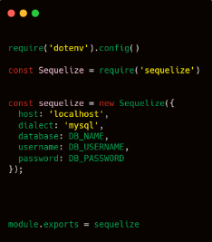
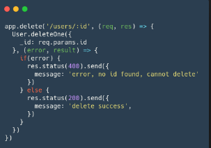
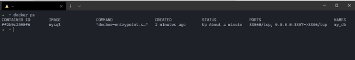

# Writing and Presentation Test Week 8

---

## Day 1 - Build Web Services and RESTful API with Express & Sequelize

### Express With MySQL

- Lakukan instalasi mysql di projek express dengan menggunakan ‘npm install mysql’
- Lalu buatlah file .js untuk untuk mengintegrasikan projek express kita dengan database mysql.

```sql
const mysql = require("mysql")

const connection = mysql.createConnection({
    host: "nama host",
    user: "nama user",
    password: "password user",
    database: "nama database"
});

module exports = connection;

connection.connect(function(err){
    if (err) {
        console.error("error connecting: "+ err.stack);
    }
    console.log("connected as id " + xonnection.threadId);
});
```

Kita bisa menggunakan dan menyisipkan perintah dan syntax SQL di dalam kode javascript kita untuk berinteraksi dengan database.


### Sequelize

Sequelize adalah ORM Node JS yang berbasis promise. Sequelize bisa digunakan dengan PostgreSQL, MySQL, MariaDB, SQLite, dan MSSQL. Dengan fitur fitur di Sequelize, kita bisa mengelola dan mengatur data di database kita dengan cepat, dan efisien.
[Sequelize](https://sequelize.org/)

**Install Sequelize**


**Setting Up Connection**


### Express with Sequelize

Integrasikan express projek kita dengan sequelize. Dengan membuat file connection.



Opsi dialect adalah database yang kita gunakan yaitu sqlite, dan storage merupakan opsi khusus dari sqlite yaitu path tempat databasenya nanti disimpan. Untuk mysql dan postgres opse storage bisa diganti dengan host dan password .


Fungsi authenticate() akan melakukan ping ke database jika berhasil maka akan mengembalikan object promise yang bisa then atau catch jika masuk then maka koneksi berhasil jika masuk catch maka koneksi gagal dan ada kesalahan dalam konfigurasi di awal.

sync() berfungsi untuk melakukan sinkronisasi model dengan database, sync() return promise dengan callback dipanggil ketika sudah melakukan sinkronisasi.

### Data Type

[Data type](https://sequelize.org/v5/manual/data-types.html)

### Defining Models


fungsi define menerima dua parameter yang pertama nama model dan yang kedua adalah skema dari tabel tersebut.

Contoh Retrieving Data:


findAll() berfungsi untuk mencari banyak data dalam database, jika panggil tanpa parameter maka akan mengambil semua data.


findOne() berfungsi untuk mencari satu spesifik data dengan kriteria pada parameter.


create() berfungsi untuk membuat data baru pada database.


update() berfungsi untuk melakukan pengubahan data.


destroy() berfungsi untuk menghapus data.
[Sequelize](https://sequelize.org/v5/manual/models-usage.html#data-retrieval---finders)

### Sequelize Migrations

Sama seperti version control pada Git, sequelize migration bekerja untuk dapat melacak perubahan pada database.

Sequelize Migration memiliki 2 functions, yaitu UP and DOWN, dimana yang berfungsi untuk melakukan migrasi, atau mengembalikan data sebelum migrasi.

Dengan fungsi sequelize.query kita juga bisa mengatur data apa saja yang akan ditambahkan, sesuai dengan kemauan kita.

### Installing the CLI

```sql
npm install --save--dev sequelize-cli
```

Untuk membuat projek kita harus mengeksekusi init command

```sql
npx sequelize-cli init
```

Dengan perintah sebelumnya, projek kita akan otomatis membuat folder:

1. Config, menyimpan file koneksi database
2. Models, menyimpan semua model di projek ini.
3. Migrations, menyimpan semua file migrasi.
4. Seeders, menyimpan semua seed files.

### Configuration


Secara default dialect atau penggunaan database akan merujuk ke “mysql”, kita bisa mengisi data di config.json sesuai dengan database dan koneksi kita.

**Note:** Jika database kita belum ada, maka kita bisa langsung membuatnya dengan command db:create

### Creating the first Model and Migration

Setelah kita mengatur konfigurasi, sekarang kita bisa langsung melakukan migration.


Dengan command model:generate, command tersebut membutuhkan 2 options, yaitu “name” dan “attributes.”


Setelah command dijalankan, file user.js akan otomatis terisi.


Begitu juga dengan folder Migrations, akan tergenerate file dengan nama XXXXXXXXXXXXX-create-user.js

**Running Migrations**
Sampai di langkah ini kita tidak memasukan apapun kedalam database, hanya membuat model User.

```sql
npx sequelize-cli db:migrate
```

Dengan command diatas, kita akan memanggil tabel SequelizeMeta di database, yang akan merekam migrasi yang mana yang berjalan di dalam database.
Kedua, migrasi file XXXXXX-create-user.js akan dijalankan.
Ketiga, membuat tabel Users di dalam database, dengan segala kolom sesuai dengan spesifikasi dari file migrasi.

**Undoing Migrations**
Setelah data berhasil dibuat dan disimpan oleh database, kita dapat meng-undo dengan perintah db:migrate:undo.


Kita bisa mengembalikan ke posisi awal dengan menggunakan undo-all,
Dan juga mengembalikan ke posisi sesuai spesifikasi dengan menambahkan --to “nama file”.

### Creating the first Seed

Seed digunakan untuk menginput data ke dalam database, dengan command “seed:generate --name ‘nama file’ ”.

``sql
npx sequelize-cli seed:generate --name demo-user

````
Command di atas akan membuat 1 file di dalam folder seeders, dengan contoh nama XXXXXXXXXX -demo-user.js.


Lalu kita ubah file dan data sesuai kemauan kita, Tabel, dan data apa yang akan kita masukan ke database.

```sql
npx sequelize-cli db:seed:all
````

Command ini akan mengeksekusi file yang berada didalam folder seeders, dan akan memasukan data nya, kedalam tabel, kolom yang sesuai di database.

**Undoing Seeds**
Seperti layaknya Migrate, Seed juga bisa kita Undo atau kembalikan ke posisi yang kita inginkan, jika ada kesalahan.


Seperti Migration, kita juga bisa meng-undo seed jika terjadi kesalahan, bisa mengembalikan ke posisi awal, atau bisa juga mengembalikan ke posisi yang diinginkan.

---

## Day 2 - Introduction & Design Databases with MongoDB - Build Web Services and RESTful API with Express & Mongoose

### MongoDB

MongoDB adalah salah satu database open source NoSQL yang cukup populer digunakan.MongoDB sering dipakai untuk aplikasi berbasis Cloud, Big Data maupun Grid COmputing. Jika SQL menyimpan data menggunakan relasi tabel, MongoDB menggunakan dokumen dengan format JSON.

**NoSQL?**
NoSQL adalah Not Only SQL. Artinya kita bisa mengolah database dengan fleksibel dan tidak membutuhkan Query. Akhirnya kita memiliki skalabilitas yang tinggi sesuai dengan perkembangan data kita.

**Kelebihan MongoDB**

- Sistem tidak membutuhkan Tabel.
- Tidak perlu menggunakan Tabel yang terstruktur.
- By Default sudah menggunakan JSON(JavaScript Object Notation), sehingga memudahkan integrasi dengan JavaScript.
- Performa lebih cepat dengan kemampuan menampung banyak data yang bervariasi.

**Kekurangan MongoDB**

- Tidak mendukung transaksi.
- Masalah konsistensi data.
- Menggunakan banyak memory.
- Hanya bisa menampung maksimal 16MB disetiap document.

**Anatomi Komponen dari Database MongoDB**


Database adalah wadah untuk menyimpan berbagai macam Collection.
Collection adalah tempat kumpulan dari berbagai macam document, sehingga collection sering disamakan dengan tabel pada SQL.
Document adalah unit terkecil yang berada pada MongoDB

**Contoh data pada MongoDB**


### Operasi CRUD MongoDB

**Untuk melihat daftar database bisa menggunakan show dbs**


**Untuk Database baru gunakan "use music"**


**Untuk menambahkan Collection baru kita bisa gunakan**

```sql
db.createCollections(“artis”)
```

Kita sudah berhasil membuat database dan mengisikan collection ke MongoDB kita.

**Untuk menambahkan data pada Collection kita bisa gunakan**

```sql
db.artis.insert({
    nama: "Peterpan",
    genre: "pop"
})
```

**Untuk melihat data kita gunakan**

```sql
db.artis.find()
```

**Untuk mengupdate data pada Collection kita bisa gunakan**

```sql
db.artis.update({
'nama':'Peterpan'
},{
$set:{'nama':'Noah'}
})
```

**Untuk menghapus data pada Collection kita bisa gunakan**

```sql
db.artis.remove({
'nama': ‘Noah’
})
```

### Cara untuk mendesain schema MongoDB

**Schema Design Relational Vs MongoDB**
Jika kita mendesain schema aplikasi MongoDB kita sama dengan mendesain SQL maka kita akan banyak kehilangan fitur MongoDB. Karena MongoDB :

- Tidak ada Formal Process
- Tidak ada algorithms
- Tidak ada aturan

Sebuah MongoDB schema desain yang baik akan memperhatikan:

- Bagaimana kita menstore data
- Menghasilkan perfoma Query yang bagus

Dalam mendesain MongoDB kita ada 2 pendekatan yaitu Embedding dan Referencing
**1. Embedding**
Keuntungan :

- Bisa mendapatkan semua data dalam 1 query.
- Bisa mengupdate semua informasi terkait dalam 1 atomic operation.
- Bisa menggunakan transaksi operator.

Kekurangan:

- kita tidak memiliki cara untuk dapat mengaksess embended data sebagai entity yang terpisah secara langsung.
- Memiliki batasan 16 MB document size

Dengan Embedding kita memasukan semua data yang terkait dalam satu dokumen.

Misalnya, asumsikan kita mendapatkan detail user dengan 2 dokumen berbeda yaitu, personal_details dan contact


**2. Referencing**
Keuntungan:

- Bisa mendapatkan semua data dalam 1 query.
- Bisa mengupdate semua informasi terkait dalam 1 atomic operation.
- Bisa menggunakan trasaksi operator.

Kekurangan:

- kita tidak memiliki cara untuk dapat mengaksess embended data sebagai entity yang terpisah secara langsung.
- Memiliki batasan 16 MB document size

Dengan Referencing kita hanya memasukan data sebagian saja tidak keseluruhan.

Misalnya, asumsikan kita mendapatkan riwayat_lagu kita hanya memberikan ObjectID nya saja


### Relasi dalam MongoDB

**One-to-One Relationships**
Hubungan one-to-one mewakili dari hubungan 2 objek yang berbeda.

Jika melanjutkan case study music streaming kita. Maka setiap user hanya akan memiliki detail membership. Detail membership masing masing user tidak akan pernah menjadi milik banyak user dan tidak ada user yang memiliki lebih dari 1 detail membership.

Cara yang disarankan adalah Embedded.
Contoh one-to-one relationships:


**One-to-Many Relationships**
Bayangkan kita sedang menggunakan aplikasi music streaming kita, Satu lagu akan diputar oleh banyak user. Lebih detailnya 1 lagu bisa diputar oleh ratusan atau ribuan user.

Cara yang disarankan adalah Reference.
Contoh one-to-many relationships:


**Many-to-Many Relationships**
Sekarang bayangkan kita sebagai seorang user bisa memiliki playlist, sebuah playlist bisa didengarkan oleh banyak user dan seorang user bisa memiliki lebih dari 1 playlist untuk didengarkan. Lalu dalam playlist kita juga berisi dari banyak lagu.

Cara yang disarankan adalah Reference.
Contoh many-to-many relationships:


---

## Day 3 - Build Web Services and RESTful API with Express & Mongoose

### MongoDB Atlas

1. Daftar akun di MongoDB Atlas, dan membuat cluster untuk dihubungkan ke MongoDB compass. [MongoDB Atlas](https://www.mongodb.com/cloud/atlas)
2. Click pada tombol “Try Free” dan isi formulir pendaftaran.
3. Pilih Shared Cluster, it’s free for learning purpose.
4. Setelah berhasil dibuat, sekarang kita bisa menghubungkan cluster kita menggunakan MongoDB Compass.
5. Setup IP dan Buat MongoDB User.
6. Copy connection string, untuk menghubungkan MongoDB Compass.
7. Kembali ke MongoDB Compass dan Paste connection stringmu.
   **Note:** pada <password>, hapus tanda <..>

### Connect NodeJS and MongoDB

1. Install dotenv untuk menampung variabel environment database. Dan juga install MongoDB

```sql
npm install dotenv --save
npm install mongodb --save
```

2. Buat satu file .env untuk menyimpan variabel database
   
3. Membuat file untuk membuat koneksi, dan interaksi dengan database langsung.
   
4. Kita menyisipkan potongan kode untuk menginsert data, untuk melihat perubahan di MongoDB Compass, dan itu berhasil.
   

### Mongoose

Mongoose adalah library yang bisa dibilang sebagai Object Modelling MongoDB untuk NodeJS.
Mongoose bisa digunakan untuk mengelola hubungan antara data, menyediakan validasi.
Dan juga digunakan untuk menerjemahkan antara objek dalam kode dan representasi Objek tersebut di MongoDB.
[Moongose](https://mongoosejs.com/docs/index.html)

**Instalasi Mongoose**
Pastikan NodeJS dan MongoDB juga sudah terinstall.

```sql
npm install mongoose
```

**Create Connection**

1. Membuat koneksi dengan menggunakan MongoDB database, yang diletakkan di .env
    
   
    
2. Kita membiasakan diri dengan menggunakan file .env untuk menyimpan URL atau data rahasia yang tidak perlu dilihat di public.
    
   
    
3. Lalu jalankan file .js kita dan kita berhasil terhubung.

**Defining your Schema**
Dari potongan kode dibawah, kita bisa melihat bahwa kita mendefine Skema, dan tipe data untuk setiap field yang akan digunakan.
    


Kita juga bisa memberikan validasi data, misal untuk field yang wajib diisi.
    


Lalu di potongan kode ini, kita menggunakan model users dari schema yang telah kita buat untuk melakukan pengolahan data, atau operasi CRUD.
    


### Simple CRUD

Sebelum membuat operasi CRUD, jangan lupa untuk menginstall express untuk routing dan body-parser, untuk menggunakan method Post dan testing API.

```sql
npm install express
npm install body-parser
```

Untuk menampilkan keseluruhan data (READ) kita bisa menggunakan fungsi find().
    


    
Kita menggunakan method POST untuk mendaftarkan user, sebelum mendaftarkan kita mengecek dulu apakah user sudah ada atau belum dengan menggunakan findOne(), jika sudah ada akan muncul pesan error, jika belum terdaftar maka user akan didaftarkan menggunakan fungsi create(),
Dan data user bisa diisi menggunakan Postman/thunder client.

Isi form raw dengan tipe JSON, atau bisa juga menggunakan form-data, untuk mendaftarkan user, setelah itu kita bisa menekan tombol send untuk mengirim request POST.
    


Dengan kode dibawah kita akan mendapatkan data user berdasarkan id, dengan fungsi findById().
    


Dengan kode dibawah kita akan menghapus satu data berdasarkan ID dengan menggunakan deleteOne().
    


Dengan kode dibawah kita akan mengedit/update satu data berdasarkan ID dengan menggunakan findByIdAndUpdate().
    


### Populate

Populate ada kaitannya dengan relasi database. Populate adalah proses penggabungan 2 collection atau lebih menjadi satu objek JSON.
Kita akan mengupdate schema user kita dan menambahkan address schema untuk mem-populate collection.

Kita menambahkan field address, denga type Schema.types.ObjectId, dan ref merujuk kepada schema “address”.
    


Kita membuat schema baru, dengan nama address, untuk di populate dengan users schema.
    


Buatlah Route dengan method POST menuju ke endpoint /address, untuk mengisi alamat, dengan mengisi juga \_id user yang ingin kita tambahkan alamat.
    


Test menggunakan Postman/thunder client, dengan ID sesuai dengan data user yang ingin ditambahkan di alamat. Lalu tambahkan alamat / address
    


Lalu ubah kode untuk menampilkan keseluruhan data user dengan kode dibawah. Kita melakukan Populate() dengan address schema, dan akan ditampilkan isi dari address.
    


Lalu kita test menggunakan Postman/thunder client untuk method GET ke endpoint /users, data users akan muncul dengan data address, berarti kita berhasil mempopulate schema users dengan address.
    


---

## Day 4 - Intro to Container & Docker - Back End Web Dev - Group Project - Briefing

### Docker

Docker merupakan software yang menjalankan suatu aplikasi yang menggunakan conatiner. Docker mensharing kernel dari host OS, serta mengcontainer kan suatu aplikasi agar dapat dijalankan dimana saja dan kapan saja. Aplikasi yang berjalan di dalam container docker tidak terpengaruh oleh faktor luar karena terisolasi.

Docker berfungsi sebagai penyedia layanan virtual bagi aplikasi yang diinstall pada sebuah host.
Docker akan menyediakan hal-hal yang diperlukan untuk aplikasi mulai dari akses file, koneksi internet, hingga port agar aplikasi dapat berjalan dengan mulus.

### Container Vs Virtual Machine

VM memakan banyak resource dan waktu untuk booting karena melakukan virtualisasi pada host hardware-nya.

Sedangkan container kebalikannya dari vm, container melakukan virtualisasi pada host OS-nya

### Docker Fundamental


**Docker File**
Blueprint untuk membuat image.
**Image**
Template untuk menjalankan container.
**Container**
Perwujudan dari image
**Docker Registry**
Template untuk upload/download image.

### Perintah Dasar

**Docker Pull**
Download image dari docker hub.
    


**Docker Images**
Melihat kumpulan images yang sudah terdownload.
    


**Docker Run**
Menjalankan Container.
    


**Docker Ps**
Melihat container yang berjalan.
    


**Docker File**
Merupakan sebuah blueprint untuk membuat image, kamu juga bisa membuat custom image menggunakan docker file.


    
Caranya:

1. Buat file Dockerfile di dalam project yang kamu buat.
2. Tulis beberapa perintah ke dalam dockerfile.
3. Jalankan docker file menggunakan perintah

```
docker build -t NAMA_IMAGES:TAG.
docker build -t my-app:1.0
```

**Blueprint**

- install node
- membuat dir /home/app
- pindah kedalam /home/app
- copy isi project saat ini kedalam container
- menjalankan node app.js
    
  

### Menjalankan react app dengan container via dockerfile

1. Siapkan project react
2. Siapkan dockerfile di dlm project react
3. Isi dengan perintah seperti di bawah
    
   
    
4. Buat imagenya dengan perintah

```
docker build -t react-app:1.0 .
```

5. Jalankan image yg sudah dibuat dengan

```
docker run -d -p 3000:3000 react-app:1.0
```

### Docker Compose

Cara untuk menjalankan lebih dari 1 container secara bersamaan dan saling terhubung.
Caranya:

1. Buat file NAMA_FILE.yaml di dalam project yang kamu buat
2. Tulis beberapa perintah ke dalam sana
3. Jalankan menggunakan perintah

```
docker-compose NAMA_FILE.yaml up
```

## 
